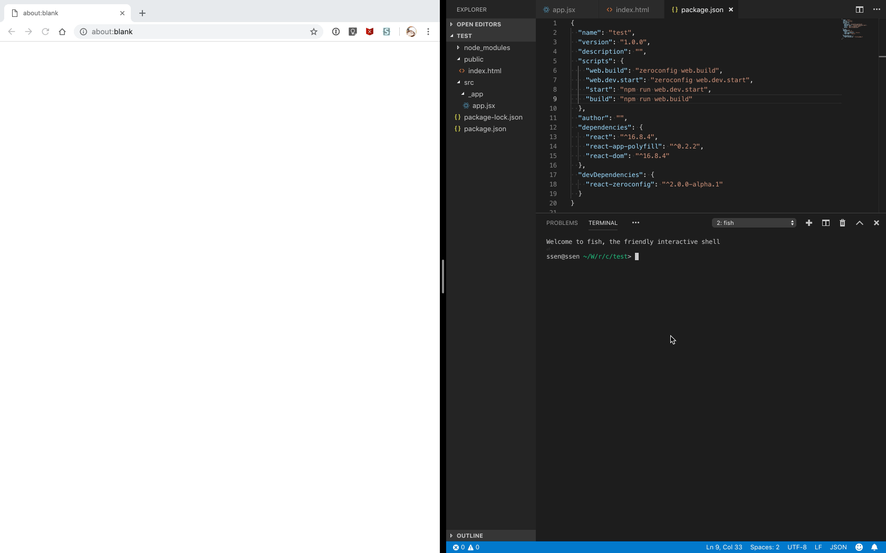
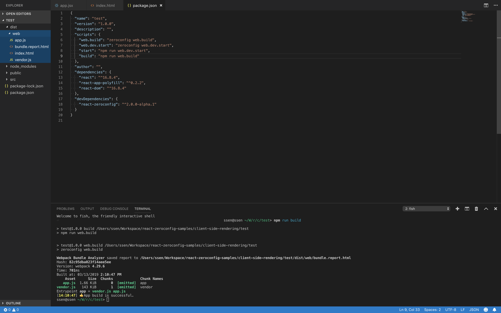

# Client Side Rendering

> ⚠️ My English is not good. Fixing bad sentences will help me a lot. <https://github.com/iamssen/react-zeroconfig/issues>

> The source codes for this document can be found at <https://github.com/iamssen/react-zeroconfig-sample.client-side-rendering>.

## Install

```sh
$ mkdir test
$ cd test
$ npm init
```

Initialize the project directory.

```sh
$ npm install react react-dom react-app-polyfill
$ npm install react-zeroconfig --save-dev
```

Install modules.

- `react`, `react-dom`: React
- `react-app-polyfill`: Polyfills to support IE
- `react-zeroconfig`: Zeroconfig

## Write code

Writing a “Hello World” code.

```jsx
// {your-project-root}/src/_app/app.jsx
import React from 'react';
import {render} from 'react-dom';
import 'react-app-polyfill/ie11';

function App() {
  return (
    <div>Hello World!</div>
  );
}

render(<App/>, document.querySelector('#app'));

// Hot Module Replacement
if (module.hot) {
  module.hot.accept();
}
```

```html
<!-- {your-project-root}/public/index.html -->
<!DOCTYPE html>
<html>
  <head>
    <meta charset=UTF-8>
    <meta name="viewport" content="width=device-width, initial-scale=1">
    <title>App</title>
  </head>
  
  <body>
    <div id="app"></div>
  </body>
  
  <script src="vendor.js"></script>
  <script src="app.js"></script>
</html>
```

Libraries such as `react`, `react-dom` and `react-app-polyfill` in the `node_modules` directory are created as `<script src="vendor.js"></script>` file.

The `_app/app.jsx` file in the `src/` directory is created as `<script src="app.js"></script>`. (This is a structure where `_entry/{name}.jsx` is generated as `<script src="{name}.js"></script>`)

## Start test

Open the `package.json` file and add the npm script marked with `+` below.

```diff
{
  "name": "test",
  "version": "1.0.0",
  "description": "",
  "scripts": {
+    "web.dev.start": "zeroconfig web.dev.start",
+    "start": "npm run web.dev.start"
  },
  "author": "",
  "dependencies": {
    "react": "^16.8.4",
    "react-app-polyfill": "^0.2.2",
    "react-dom": "^16.8.4"
  },
  "devDependencies": {
    "react-zeroconfig": "^2.0.0"
  }
}
```

- `zeroconfig web.dev.start` runs the development server with a combination of `webpack-dev-middleware`, `webpack-hot-middleware` and `browser-sync`.

```sh
$ npm start
```

Run the npm script.

[](images/start.gif)

Open your web browser and connect to <http://localhost:3100>.

If "Hello World!" appeares, it is a success.

## Checking HMR (Hot Module Replacement) operation

`react-zeroconfig` supports HMR (Hot Module Replacement).

Open the file `src/_entry/app.jsx` and modify the text "Hello World!".

[](images/hmr.gif)

You can see the changes are reflected in real time on the web browser.

> The HMR feature does not reflect 100% of all modifications. Refresh may also be required.

## Build

Open the `package.json` file and add the npm script marked with `+` below.

```diff
{
  "name": "test",
  "version": "1.0.0",
  "description": "",
  "scripts": {
+    "web.build": "zeroconfig web.build",
    "web.dev.start": "zeroconfig web.dev.start",
    "start": "npm run web.dev.start",
+    "build": "npm run web.build"
  },
  "author": "",
  "dependencies": {
    "react": "^16.8.4",
    "react-app-polyfill": "^0.2.2",
    "react-dom": "^16.8.4"
  },
  "devDependencies": {
    "react-zeroconfig": "^2.0.0"
  }
}
```

- `zeroconfig web.build`: Use the Webpack to build a `dist/web/` directory of output that you can run in web browser.

```sh
$ npm run build
```

Run the npm script.

[](images/build.gif)
[](images/build.png)

You can see that the js and html files are built in `dist/web/` directory.

--------

## Check the files built with http-server

Make sure that the built files are working properly.

```sh
$ npm install -g http-server
```

Install `http-server` which can execute Static Web Server sasily.

```sh
$ cd dist/web
$ http-server . -p 9990
```

Navigate to the `dist/web/` directory and try running Web Server with port 9990.

[](images/http-server.gif)

You can check it by connecting to <http://localhost:9990>.