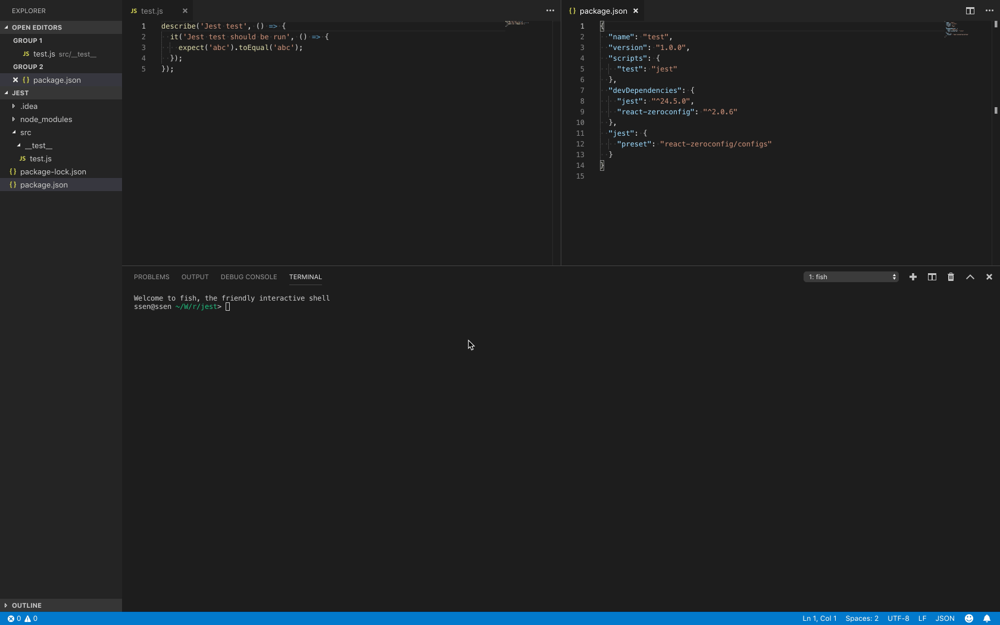

<!-- START doctoc generated TOC please keep comment here to allow auto update -->
<!-- DON'T EDIT THIS SECTION, INSTEAD RE-RUN doctoc TO UPDATE -->


- [Jest로 Test 실행해보기](#jest%EB%A1%9C-test-%EC%8B%A4%ED%96%89%ED%95%B4%EB%B3%B4%EA%B8%B0)
- [Install](#install)
- [Config](#config)
- [Test Code 작성하고 실행해보기](#test-code-%EC%9E%91%EC%84%B1%ED%95%98%EA%B3%A0-%EC%8B%A4%ED%96%89%ED%95%B4%EB%B3%B4%EA%B8%B0)
- [Test File Match](#test-file-match)

<!-- END doctoc generated TOC please keep comment here to allow auto update -->

# Run test with Jest

> ⚠️ I can not speak English well. It will be helpful if you correct the wrong expressions and send the PR. (If you have modified this document, please delete this comment.)

If the settings of Babel and Webpack are complicated, the Jest setting becomes complicated too.

For example, if you use the webpack file-loader like `import fileUrl from 'image.png'`, you need to add a mock setting to the Jest.

And adding Babel's settings like Typescript is troublesome because you have to make the same settings for Jest.

`react-zeroconfig` has a Jest preset with preconfigured settings related to Babel and Webpack, so you can run the Jest test without complicated setup.

# Install

Initialize the project directory.

```sh
$ mkdir test
$ cd test
$ npm init
```

Install a module.

```sh
$ npm install react-zeroconfig jest --save-dev 
```

# Config

Open the `package.json` file and add the npm scripts marked with `+` below.

```diff
{
  "name": "test",
  "version": "1.0.0",
  "scripts": {
+    "test": "jest"
  },
  "devDependencies": {
    "jest": "^24.5.0",
    "react-zeroconfig": "^2.0.6"
  },
+  "jest": {
+    "preset": "react-zeroconfig/configs"
+  }
}
```

Use the pre-made Jest preset in `react-zeroconfig`. <https://github.com/iamssen/react-zeroconfig/blob/master/configs/jest-preset.js> 

# Create and run test code

Create a sample test code

```js
// {your-project-root}/src/__test__/test.js
describe('Jest test', () => {
  it('Jest test should be run', () => {
    expect('abc').toEqual('abc');
  });
});
```

Run the test.

```sh
$ npm test
```



# Test File Match

The types of files that are matched to the Jest test are listed below. <https://github.com/iamssen/react-zeroconfig/blob/master/configs/jest-preset.js#L13>

- `**/__tests?__/**/*.[jt]s?(x)`
    - ⭕️ `src/__tests__/a.js`
    - ⭕️ `src/__test__/a.tsx`
    - ⭕️ `src/a/b/__test__/c/d.ts`
    - ❌ ~~`src/test/a.js`~~
- `**/?(*.)(spec|test).[jt]s?(x)`
    - ⭕️ `src/app/data/update.test.js` 
    - ⭕️ `src/app/components/Button.test.tsx`
    - ❌ ~~`src/app/components/Button.tsx`~~