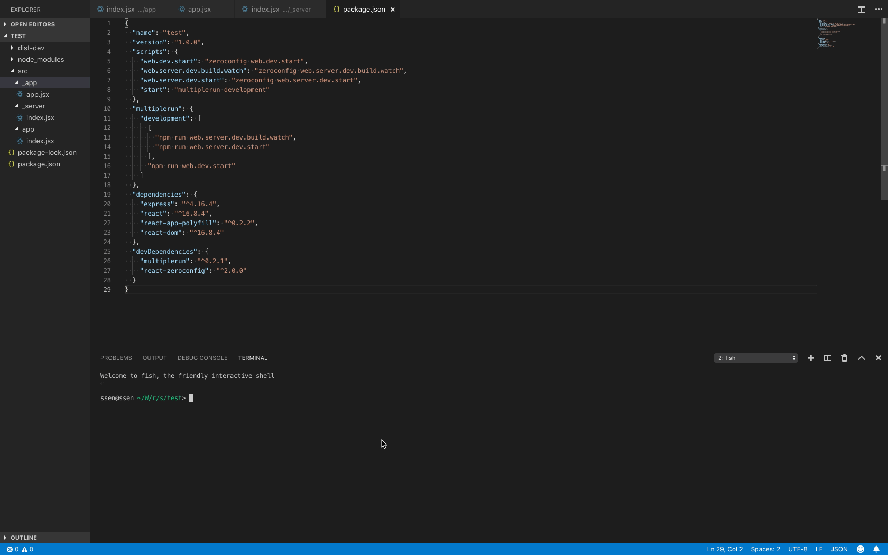
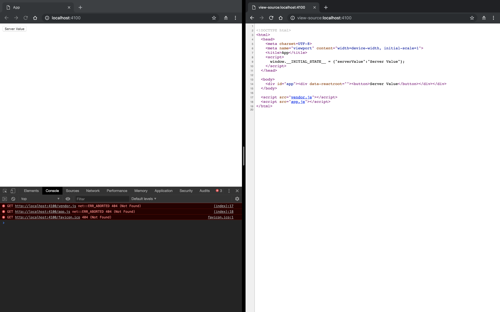
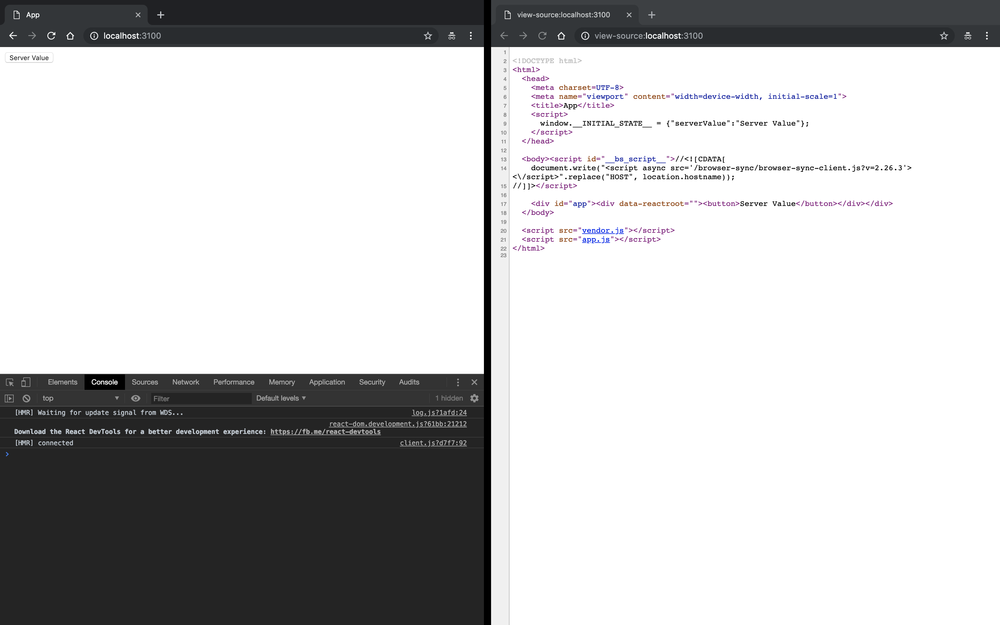
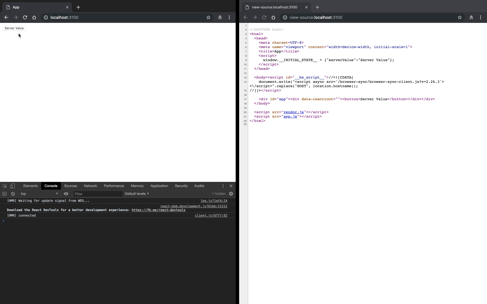
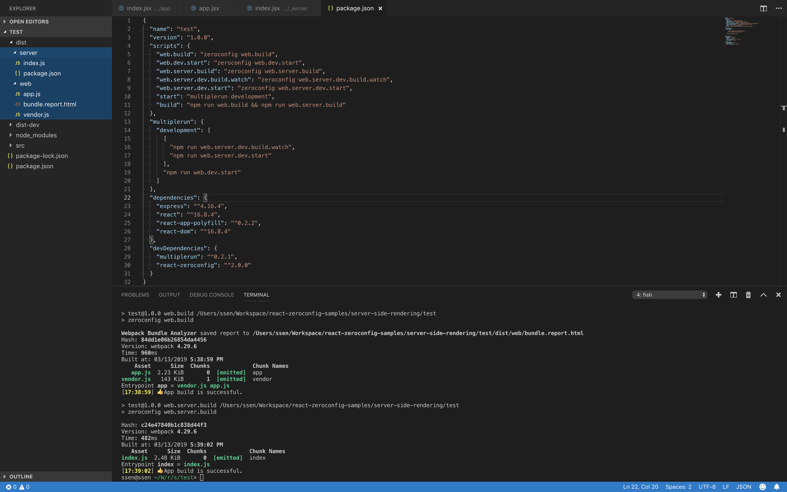

# Server Side Rendering

> ⚠️ My English is not good. Fixing bad sentences will help me a lot. <https://github.com/iamssen/react-zeroconfig/issues>

> The source codes for this document can be found at <https://github.com/iamssen/react-zeroconfig-sample.server-side-rendering>.

## Install

```sh
$ mkdir test
$ cd test
$ npm init
```

Initialize the project directory.

```sh
$ npm install react react-dom react-app-polyfill express
$ npm install react-zeroconfig multiplerun --save-dev
```

Install modules.

- `react`, `react-dom`: React
- `react-app-polyfill`: Polyfills to support IE
- `express`: Express.js to run Server for Server Side Rendering
- `react-zeroconfig`: Zeroconfig
- `multiplerun`: The Server Side Rendering test requires multiple Terminal runs. This module is required to execute the terminals in batch.

## Write code

Writing a “Hello World” code.

```jsx
// {your-project-root}/src/app/index.jsx
import React, { useState } from 'react';

export function App({initialState = {}}) {
  const [value, setValue] = useState(initialState.serverValue || 'Default Value');
  
  function updateValue() {
    setValue('Value ' + Date.now());
  }

  return (
    <div>
      <button onClick={updateValue}>
        {value}
      </button>
    </div>
  );
}
```

```jsx
// {your-project-root}/src/_entry/app.jsx
import React from 'react';
import { hydrate } from 'react-dom';
import { App } from '../app';
import 'react-app-polyfill/ie11';

hydrate((
  <App initialState={window.__INITIAL_STATE__}/> 
), document.querySelector('#app'));

// Hot Module Replacement
if (module.hot) {
  module.hot.accept();
}
```

```jsx
// {your-project-root}/src/_server/index.jsx
import React from 'react';
import express from 'express';
import { renderToString } from 'react-dom/server';
import { App } from '../app';

const port = process.env.SERVER_PORT || 4100;
const app = express();

const template = ({initialState, body}) => `
<!DOCTYPE html>
<html>
  <head>
    <meta charset=UTF-8>
    <meta name="viewport" content="width=device-width, initial-scale=1">
    <title>App</title>
    <script>
      window.__INITIAL_STATE__ = ${JSON.stringify(initialState)};
    </script>
  </head>
  
  <body>
    <div id="app">${body}</div>
  </body>
  
  <script src="vendor.js"></script>
  <script src="app.js"></script>
</html>
`;

app.get('/', (req, res) => {
  const initialState = {serverValue: 'Server Value'};
  const body = renderToString(<App initialState={initialState}/>);
  
  res.send(template({initialState, body}));
});

app.listen(port, () => {
  console.log(`Server started ${port}`);
});
```

Libraries such as `react`, `react-dom` and `react-app-polyfill` in the `node_modules` directory are created as `<script src="vendor.js"></script>` file.

The `_app/app.jsx` file in the `src/` directory is created as `<script src="app.js"></script>`. (This is a structure where `_entry/{name}.jsx` is generated as `<script src="{name}.js"></script>`)

## Start test

Open the `package.json` file and add the npm script marked with `+` below.

```diff
{
  "name": "test",
  "version": "1.0.0",
  "scripts": {
+    "web.dev.start": "zeroconfig web.dev.start",
+    "web.server.dev.build.watch": "zeroconfig web.server.dev.build.watch",
+    "web.server.dev.start": "zeroconfig web.server.dev.start",
+    "start": "multiplerun development"
  },
+  "multiplerun": {
+    "development": [
+      [
+        "npm run web.server.dev.build.watch",
+        "npm run web.server.dev.start"
+      ],
+      "npm run web.dev.start"
+    ]
+  },
  "dependencies": {
    "express": "^4.16.4",
    "react": "^16.8.4",
    "react-app-polyfill": "^0.2.2",
    "react-dom": "^16.8.4"
  },
  "devDependencies": {
    "multiplerun": "^0.2.1",
    "react-zeroconfig": "^2.0.0"
  }
}
```


- `zeroconfig web.dev.start`: Run the development server with a combination of `webpack-dev-middleware`, `webpack-hot-middleware` and `browser-sync`.
- `zeroconfig web.server.dev.build.watch`: Use the Webpack watch mode to continuously build the `src/_server/index.jsx` file into a `dist-dev/server/index.js` file.
- `zeroconfig web.server.dev.start`: Run the `dist-dev/server/index.js` file using Nodemon and automatically rerun it whenever there is an update.

It is very inconvenient to open the terminal window to execute the above three scripts at the same time, so you use `multiplerun` to execute the scripts in a batch. <https://www.npmjs.com/package/multiplerun>

```sh
$ npm start
```

Run the npm script.

[](images/start.gif)

The above three npm scripts will be executed simultaneously.

> If you are using macOS and iTerm is installed, it will be opened using iTerm Split-Pane as above. Otherwise, 3 terminals (Terminal.app or cmd.exe) will be opened.

## Verify operation

First, make sure that Server Side Rendering is working normally.

Open your web browser and check <http://localhost:4100> and <view-source:localhost:4100>.

[](images/4100.png)

If "Server Value" is displayed as above, it is a success.

Then check <http://localhost:3100> and <view-source:localhost:3100>.

[](images/3100.png)

If "Server Value" is displayed as above, it is a success.

[](images/click.gif)

To check if the React is working properly, press the button to confirm that the text changes.

## Build

Open the `package.json` file and add the npm script marked with `+` below.

```diff
{
  "name": "test",
  "version": "1.0.0",
  "scripts": {
+    "web.build": "zeroconfig web.build",
    "web.dev.start": "zeroconfig web.dev.start",
+    "web.server.build": "zeroconfig web.server.build",
    "web.server.dev.build.watch": "zeroconfig web.server.dev.build.watch",
    "web.server.dev.start": "zeroconfig web.server.dev.start",
    "start": "multiplerun development",
+    "build": "npm run web.build && npm run web.server.build"
  },
  "multiplerun": {
    "development": [
      [
        "npm run web.server.dev.build.watch",
        "npm run web.server.dev.start"
      ],
      "npm run web.dev.start"
    ]
  },
  "dependencies": {
    "express": "^4.16.4",
    "react": "^16.8.4",
    "react-app-polyfill": "^0.2.2",
    "react-dom": "^16.8.4"
  },
  "devDependencies": {
    "multiplerun": "^0.2.1",
    "react-zeroconfig": "^2.0.0"
  }
}
```

- `zeroconfig web.build`: Use the Webpack to build a `dist/web/` directory of output that you can run in web browser.
- `zeroconfig web.server.build`: Use the Webpack to build the output you can run on Node.js into the `dist/server/` directory.

```sh
$ npm run build
```

Run the npm script.

[](images/build.gif)
[](images/build.png)

You can see the files built in `dist/web/` and `dist/server/` as above.

------

## Running built-in files using PM2, NginX

Try to build `dist/web/` and `dist/server/` in real environment.

1. Can be run as `dist/server` Node.js
2. Connecting from `dist/web` web server to static file.
3. Connect Node.js(1) from Web Server(2) to Reverse Proxy.

> Describe macOS + Homebrew.

```sh
$ brew install nginx
$ npm install -g pm2
```

Install Node.js process manager `pm2` and `nginx`.

```sh
$ cd dist/server
$ pm2 start index.js
```

Run `dist/server/` with PM2.

[](images/pm2.gif)

You can check the execution at <http://localhost:4100>.

Add config to NginX.

```sh
$ cd /usr/local/etc/nginx/servers
$ nano test-server.conf
```

Create a `test-server.conf` file.

```
server {
  set $STATIC_FILES /{your-project-root}/dist/web;
  set $SSR_PORT 4100;

  listen       8000;
  server_name  localhost;

  location / {
    proxy_redirect off;
    proxy_set_header X-Real-IP $remote_addr;
    proxy_set_header X-Forwarded-For $proxy_add_x_forwarded_for;
    proxy_set_header Host $http_host;
    proxy_set_header X-NginX-Proxy true;
    proxy_set_header Connection "";
    proxy_http_version 1.1;

    proxy_pass http://127.0.0.1:$SSR_PORT;
  }

  location ~ ^/(.*)\.(.*)$ {
    root $STATIC_FILES;
    autoindex off;
    expires off;
  }
}
```

- `location ~ ^/(.*)\.(.*)$`: Requests with all extensions will call static files. 
- `location /`: All other requests are connected to the application executed in `pm2` through `proxy_pass http://127.0.0.1:$SSR_PORT`. (Reverse Proxy)

When you are finished, run NginX.

```sh
$ brew service start nginx
```

[](images/nginx.gif)

Open your web browser and check <http://localhost:8000>.