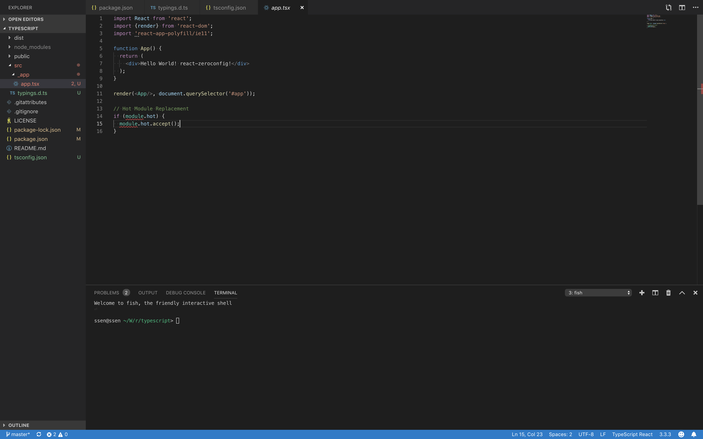
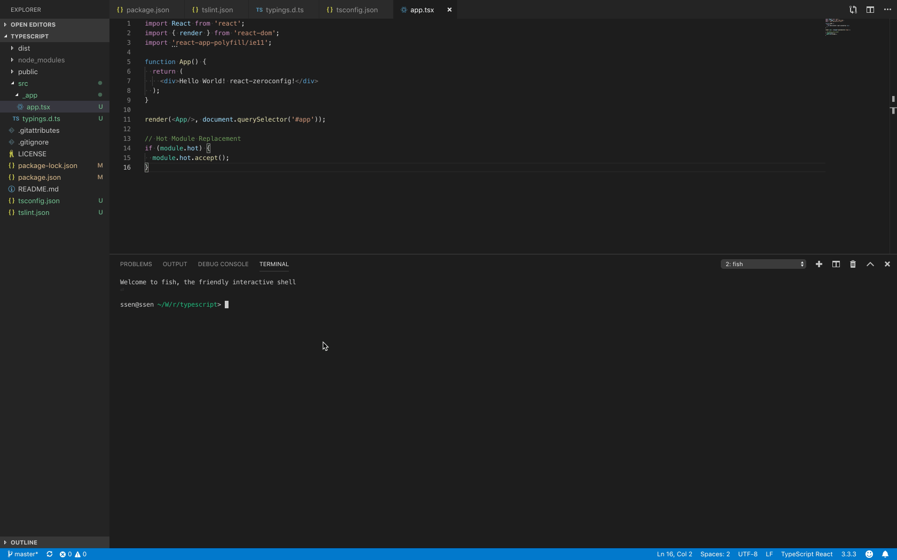
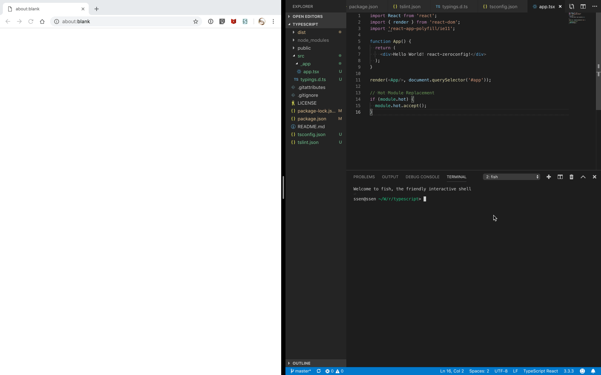

<!-- START doctoc generated TOC please keep comment here to allow auto update -->
<!-- DON'T EDIT THIS SECTION, INSTEAD RE-RUN doctoc TO UPDATE -->


- [Typescript 셋팅하기](#typescript-%EC%85%8B%ED%8C%85%ED%95%98%EA%B8%B0)
- [Typescript 설치하고, `tsconfig.json` 파일 생성하기](#typescript-%EC%84%A4%EC%B9%98%ED%95%98%EA%B3%A0-tsconfigjson-%ED%8C%8C%EC%9D%BC-%EC%83%9D%EC%84%B1%ED%95%98%EA%B8%B0)
- [`typesync`로 Typescript Declaration 파일들 설치하기](#typesync%EB%A1%9C-typescript-declaration-%ED%8C%8C%EC%9D%BC%EB%93%A4-%EC%84%A4%EC%B9%98%ED%95%98%EA%B8%B0)
- [`typings.d.ts` 파일 추가하기](#typingsdts-%ED%8C%8C%EC%9D%BC-%EC%B6%94%EA%B0%80%ED%95%98%EA%B8%B0)
- [TSLint 설정하기](#tslint-%EC%84%A4%EC%A0%95%ED%95%98%EA%B8%B0)
- [`*.jsx` 파일을 `*.tsx` 파일로 변경](#jsx-%ED%8C%8C%EC%9D%BC%EC%9D%84-tsx-%ED%8C%8C%EC%9D%BC%EB%A1%9C-%EB%B3%80%EA%B2%BD)
- [Test](#test)

<!-- END doctoc generated TOC please keep comment here to allow auto update -->

# Typescript 셋팅하기

> 이 예제는 [Client Side Rendering](../Client-Side-Rendering/ko.md)에서 이어집니다.

`react-zeroconfig`는 ES6 이외에도 Babel을 기반으로 한 Typescript 언어의 사용이 가능합니다.

그리고, Typescript 사용에 필요한 `tsconfig.json`, `typings.d.ts`, `tslint.json` 등의 Config를 지원하기 때문에 Typescript를 좀 더 간단하게 사용할 수 있습니다.

> 이 문서의 소스코드는 <https://github.com/iamssen/react-zeroconfig-sample.typescript>에서 확인할 수 있습니다.

# Typescript 설치하고, `tsconfig.json` 파일 생성하기

Typescript를 설치합니다.

```sh
$ npm install typescript --save-dev
```

`tsconfig.json` 파일을 만들어줍니다.

```json5
// {your-project-root}/tsconfig.json
{
  "extends": "react-zeroconfig/configs/tsconfig",
  "compilerOptions": {
    "baseUrl": "src",
    "paths": {
      "*": [
        "_modules/*",
        "*"
      ]
    }
  },
  "exclude": [
    "dist",
    "dist-dev",
    "*.js"
  ]
}
```

- 기본 Typescript 세팅은 `react-zeroconfig/configs/tsconfig`를 상속받아 사용할 수 있습니다.
  - <https://github.com/iamssen/react-zeroconfig/blob/master/configs/tsconfig.json> 이 파일을 상속받게 됩니다.
- `baseUrl`과 `paths` 설정을 해줍니다.
  - `import z from 'x/y/z'`를 import 할때, `<baseUrl>/x/y/z` 또는 `<baseUrl>/_modules/x/y/z`를 검색하게 됩니다.
  - 기술적으로 좀 더 자세한 내용은 <https://www.typescriptlang.org/docs/handbook/module-resolution.html>에서 확인할 수 있습니다.
- `exclude` 설정은 Typescript 컴파일에 `dist/` 디렉토리나 `dist-dev/` 디렉토리 또는 `*.js` 파일들이 포함되지 않게 해줍니다.

# `typesync`로 Typescript Declaration 파일들 설치하기

Typescript가 정상적으로 작동하기 위해서는 Declaration 파일들이 필요합니다. 

> `react`를 예로 들자면 <https://github.com/DefinitelyTyped/DefinitelyTyped/blob/master/types/react/index.d.ts> 이런 파일이 있어야 Typescript에서 `react`가 정상적으로 동작하게 됩니다.

1. Module 자체적으로 Typescript Declaration 파일을 가지고 있는 경우도 있습니다. <https://github.com/moment/moment/blob/develop/moment.d.ts> moment같이 자체적으로 `*.d.ts` 파일을 가지고 있는 경우 별도의 Declaration 파일을 설정할 필요가 없습니다.
2. 그렇지 않은 경우 `npm install @types/{name} --save-dev`로 Typescript Declaration 파일을 구할 수 있습니다. (`react`의 경우 `@types/react`를 설치하면 됩니다.)

`npm install @types/react --save-dev`와 같은 식으로 Typescript Declaration 파일들을 일일히 설치할 수도 있지만, 꽤나 번거로운 일입니다. `typesync`를 사용해서 이 작업을 자동화 시킬 수 있습니다.

`typesync`를 설치해 줍니다.

```sh
$ npm install -g typesync 
```

프로젝트 디렉토리에서 `typesync`를 실행해줍니다.

```sh
$ typesync
```

[](images/typesync.gif)

`typesync`는 위와 같이 설치 가능한 `@types/*` 모듈들을 `package.json`에 추가해줍니다.

# `typings.d.ts` 파일 추가하기

`typings.d.ts` 파일을 추가해줍니다.

```typescript
// {your-project-root}/src/typings.d.ts
/// <reference types="react-zeroconfig/configs/typings"/>

```
> `react-zeroconfig/configs/typings` 파일은 <https://github.com/iamssen/react-zeroconfig/blob/master/configs/typings.d.ts>에서 확인할 수 있습니다.

더불어, `typesync`에서 찾을 수 없는 Declaration이 있는 경우. 이 파일에 추가할 수 있습니다.  (Declaration 작성에 관련된 내용은 <https://www.typescriptlang.org/docs/handbook/modules.html> 에서 확인할 수 있습니다)

```typescript
// {your-project-root}/src/typings.d.ts
/// <reference types="react-zeroconfig/configs/typings"/>

// 예를 들자면 이런식으로 `some-module`에 대한 Declaration을 작성할 수 있습니다 
declare module 'some-module' {
  export const foo: () => string;
}
```

> 파일이름이 꼭 `typings.d.ts`일 필요는 없습니다. `*.d.ts` 확장자를 가지고 있기만 하면 됩니다.

# TSLint 설정하기

TSLint는 Typescript의 검출 능력을 강화시키는데 도움을 줍니다.

TSLint와 TSLint ruleset을 설치합니다. 

```sh
$ npm install tslint tslint-ssen-rules --save-dev
```

> Ruleset은 다른 유명한 ruleset들도 많은데, 일단 여기서는 제가 사용하는 ruleset으로 진행하겠습니다.

`tslint.json` 파일을 만들어줍니다.

```json5
// {your-project-root}/tslint.json
{
  "extends": "tslint-ssen-rules"
}
```

`package.json` 파일을 열어서 `+` 표시된 npm script를 추가해줍니다.

```diff
// {your-project-root}/package.json
{
  "name": "test",
  "version": "1.0.0",
  "description": "",
  "scripts": {
    "web.build": "zeroconfig web.build",
    "web.dev.start": "zeroconfig web.dev.start",
    "start": "npm run web.dev.start",
    "build": "npm run web.build",
+    "lint": "tslint \"src/**/!(*.spec|*.test).ts?(x)\""
  },
  "author": "",
  "license": "MIT",
  "dependencies": {
    "react": "^16.8.3",
    "react-dom": "^16.8.3"
  },
  "devDependencies": {
    "react-zeroconfig": "^2.0.0",
    "tslint": "^5.13.0",
    "tslint-ssen-rules": "^1.1.0",
    "typescript": "^3.3.3333",
    "@types/react": "^16.8.5",
    "@types/react-dom": "^16.8.2"
  }
}
```

# `*.jsx` 파일을 `*.tsx` 파일로 변경

Typescript 설정이 완료되었으면 `src/_app/app.jsx` 파일을 `src/_app/app.tsx` 파일로 확장자를 바꿔줍니다.

[](images/error.png)

확장자를 `*.tsx`로 바꾸면 이런 에러가 나게 됩니다.

`typesync`가 찾아주지 못하는 모듈이 있기 때문인데, 이런 모듈들은 수동으로 설치 해줘야 합니다.

HMR 관련 Declaration이 포함되어 있는 `@types/webpack-env`를 설치해줍니다.

```sh
$ npm install @types/webpack-env --save-dev
```

# Test

모든 작업이 완료되었다면 npm script들이 정상적으로 동작하는지 확인해봅니다.

```sh
$ npm run lint
```

[](images/lint.gif)

```sh
$ npm start
```

[](images/start.gif)

```sh
$ npm run build
```

[](images/build.gif)